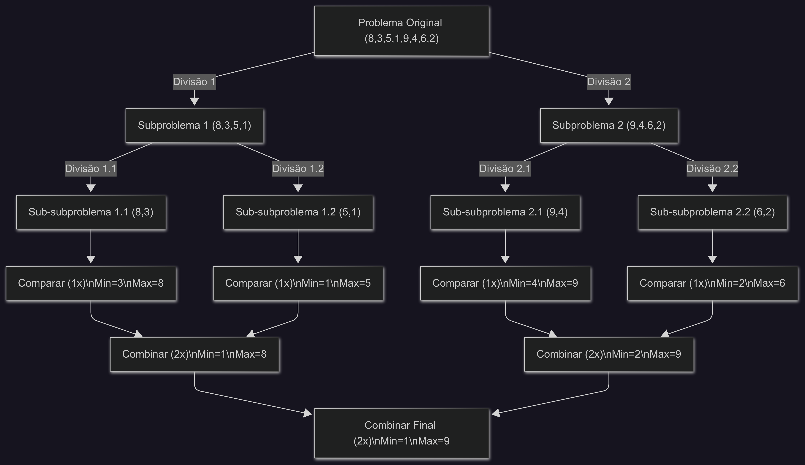

# Projeto MaxMin Select

### 1. DESCRIÇÃO DO PROJETO

O projeto consiste na implementação do algoritmo de seleção simultânea do maior e do menor elemento de um vetor. A solução foi desenvolvida em Python, utilizando a abordagem de **divisão e conquista** para otimizar o número de comparações e garantir uma complexidade de tempo linear.

#### 1.1 Lógica do Algoritmo (Implementação Linha a Linha)

O código é estruturado em uma função recursiva que divide o problema em subproblemas menores até que a solução se torne trivial.

```python
def max_min_select(arr, inicio, fim):
    # Caso Base 1: Se há apenas um elemento, ele é o mínimo e o máximo.
    if inicio == fim:
        return arr[inicio], arr[inicio]

    # Caso Base 2: Se há dois elementos, realiza uma única comparação.
    if fim == inicio + 1:
        return (arr[inicio], arr[fim]) if arr[inicio] < arr[fim] else (arr[fim], arr[inicio])

    # --- Divisão ---
    # Encontra o índice do meio para dividir o array.
    meio = (inicio + fim) // 2

    # --- Conquista ---
    # Chama a função recursivamente para a metade esquerda e direita.
    min_esq, max_esq = max_min_select(arr, inicio, meio)      # Custo: T(n/2)
    min_dir, max_dir = max_min_select(arr, meio + 1, fim)    # Custo: T(n/2)

    # --- Combinação ---
    # Compara os mínimos e máximos das duas metades (2 comparações).
    menor_final = min_esq if min_esq < min_dir else min_dir
    maior_final = max_esq if max_esq > max_dir else max_dir

    return menor_final, maior_final
```

### 2. EXECUÇÃO DO PROJETO

#### 2.1 Pré-requisitos

* **Python 3.x.x** instalado no sistema.
* **Git** para clonar o repositório (opcional, pode-se baixar o ZIP).

#### 2.2 Instruções de Execução

1. **Clone o repositório** (substitua com o seu link):

    ```bash
    git clone https://github.com/rfradieddine/fundamentos--projeto-analise-algoritmo
    ```

2. **Acesse o diretório do projeto**:

    ```bash
    cd trabalho_individual_2_FPAA
    ```

3. **Execute o programa**:

    ```bash
    python main.py
    ```

4. **Insira os dados** quando solicitado pelo terminal (números separados por espaço).

    ```
    Digite uma lista de números separados por espaço: 5 10 3 8 22 1
    ```

### 3. RELATÓRIO TÉCNICO

#### 3.1 Análise por Contagem de Operações

A complexidade é determinada pelo número de comparações `C(n)`.

* **Equação de recorrência**:
    $C(n) = \begin{cases} 0 & \text{se } n=1 \\ 1 & \text{se } n=2 \\ 2C(n/2) + 2 & \text{se } n>2 \end{cases}$

* **Desenvolvimento**: A cada nível da árvore de recursão, o número de subproblemas dobra e o tamanho de cada um cai pela metade. A etapa de combinação adiciona 2 comparações por chamada não base.

* **Solução Fechada**: Para `n` sendo uma potência de 2, a solução da recorrência é $C(n) = \frac{3n}{2} - 2$.
  * **Prova por indução (exemplo n=4):**
        $C(4) = 2C(2) + 2 = 2(1) + 2 = 4$.
        Fórmula: $\frac{3 \times 4}{2} - 2 = 6 - 2 = 4$. (Correto)

* **Complexidade**: Como o termo dominante é `n`, a complexidade assintótica é $O(n)$.

#### 3.2 Análise pelo Teorema Mestre

Analisamos a recorrência de tempo $T(n) = 2T(n/2) + O(1)$.

* **Passo 1: Identificação**
  * `a = 2` (número de subproblemas)
  * `b = 2` (fator de redução do tamanho da entrada)
  * `f(n) = O(1)` (custo do trabalho de combinação, que é constante)

* **Passo 2: Cálculo de $n^{\log_b a}$**
  * $\log_b a = \log_2 2 = 1$.
  * Portanto, $n^{\log_b a} = n^1 = n$.

* **Passo 3: Comparação e Determinação do Caso**
  * Comparamos $f(n) = O(1)$ com $n$.
  * Como $f(n)$ é polinomialmente menor que $n$ (isto é, $O(1) = O(n^{1-\epsilon})$ para $\epsilon = 1$), a recorrência se enquadra no **Caso 1** do Teorema Mestre.

* **Passo 4: Solução**
  * A solução para o Caso 1 é $T(n) = \Theta(n^{\log_b a})$.
  * Portanto, $T(n) = \Theta(n)$.

#### 3.3 Comparação dos Métodos

Ambos os métodos de análise concluem que o algoritmo tem uma complexidade de tempo linear.

* **Contagem de Operações**: Fornece o número exato de comparações ($\frac{3n}{2} - 2$), provando a eficiência do algoritmo. Confirma a complexidade $O(n)$.
* **Teorema Mestre**: Fornece um limite assintótico justo ($\Theta(n)$), confirmando que o crescimento do tempo de execução é diretamente proporcional ao número de elementos.

### 4. EXEMPLO COMPLETO

Análise para a entrada `[8, 3, 5, 1, 9]`, onde `n=5`.

1. **Chamada inicial**: `max_min_select([8, 3, 5, 1, 9], 0, 4)`
    * Divisão: `meio = 2`. Subproblemas: `[8, 3, 5]` e `[1, 9]`.

2. **Subproblema Esquerdo**: `max_min_select([8, 3, 5], 0, 2)`
    * Divisão: `meio = 1`. Subproblemas: `[8, 3]` e `[5]`.
    * `max_min_select([8, 3], 0, 1)` -> retorna `(3, 8)` (**1 comparação**).
    * `max_min_select([5], 2, 2)` -> retorna `(5, 5)` (**0 comparações**).
    * Combinação de `(3, 8)` e `(5, 5)` -> `min(3,5)` e `max(8,5)` -> retorna `(3, 8)` (**2 comparações**).

3. **Subproblema Direito**: `max_min_select([1, 9], 3, 4)`
    * Caso base de 2 elementos -> retorna `(1, 9)` (**1 comparação**).

4. **Combinação Final**:
    * Resultados: `(3, 8)` da esquerda e `(1, 9)` da direita.
    * `min(3, 1)` e `max(8, 9)` -> retorna `(1, 9)` (**2 comparações**).

* **Total de Comparações**: `1 + 0 + 2 + 1 + 2 = 6`.

### 5. LIMITAÇÕES

* **Profundidade de Recursão**: Para listas extremamente grandes (geralmente milhões de elementos), o Python pode atingir seu limite de profundidade de recursão, resultando em um `RecursionError` (stack overflow).
* **Overhead de Funções**: Para listas muito pequenas (ex: n < 20), a sobrecarga de chamadas de função recursivas pode tornar esta abordagem ligeiramente mais lenta que uma simples varredura iterativa.
* **Comparação com Funções Nativas**: As funções `min()` e `max()` nativas do Python são implementadas em C e altamente otimizadas, sendo geralmente mais rápidas na prática. O valor deste algoritmo é teórico e didático.

### 6. DIAGRAMA



### 7. REFERÊNCIAS

* [Introduction to Divide and Conquer Algorithm
](https://www.geeksforgeeks.org/dsa/introduction-to-divide-and-conquer-algorithm/)
* Materiais de aula da disciplina de Fundamentos de Projeto e Análise de Algoritmos.
